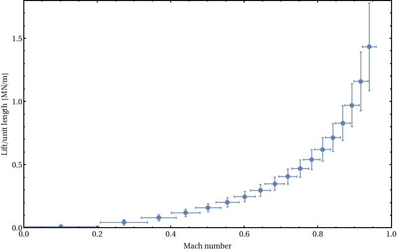

# Aerofoil lift

This example considers the lift of an aerofoil moving through air at constant subsonic speed.  A Pitot tube measures the static and total pressure of the airflow over the aerofoil and from these pressure measurements, the Mach number (ratio of the airflow speed to the speed of sound) and the lift force exerted on the aerofoil are calculated. The primary aim of the calculation is to track uncertainties in pressure measurements, as well as in simple geometric properties of the aerofoil, through to the final predictions of Mach number and lift.

The equations used here are valid for subsonic, compressible flow with a thin aerofoil with low angle of attack [^1].

## Pitot tube & pressure measurements

The relationship between Mach number $M$ and Pitot-tube pressures at subsonic speeds reads (p. 603[^1])
$$\qquad\qquad\qquad\qquad\qquad M^2 = \frac{2}{\gamma-1}\left[\left(\frac{p'}{p}\right)^{(\gamma-1)/\gamma} - 1\right] \qquad\qquad\qquad\qquad\qquad(1)$$
where $p$ is the static pressure, $p'$ the total pressure in the Pitot tube, and $\gamma$ the specific heat ratio of the air.

Uncertainties in the pressures come from two sources: (1) variations, both spatial and temporal, of the airflow; and (2) detector uncertainty. We thus conceptualise the static pressure $p$ as a random variable $p = X_p + X_{\text{det}}$ in which $X_p$ is a Gaussian random variable $X_p \sim \mathcal{N}(\bar{p}, \sigma_p)$ that describes pressure fluctuations, and $X_{\text{det}}$ is a second, indepedent Gaussian random variable $X_{\text{det}}\sim \mathcal{N}(0, \sigma_{\text{det}})$ that describes measurement uncertainty.

Fluctuations in the Pitot pressure, $p'$, may be correlated with those in the observed static pressure to a greater or lesser extent, with the degree depending on the properties of the airflow as well e.g. the spacing of the detectors. We therefore write
$$p' = s (X_p - \bar{p} + \bar{p'}) + (1-s) X_p' + X_{\text{det}}'$$
where $X_p' \sim \mathcal{N}(\bar{p}', \sigma_p)$ and $X_{\text{det}}'$ are further independent random variables modeling fluctuations and detector uncertainties respectively, and where $s\in[0,1]$ is a parameter that describes the degree of correlation between the two pressure measurements.

We specify the value of the Pitot pressure as  $\bar{p}' = \bar{p} + f_p (p_\text{max}'-\bar{p})$ where $f_p$ is a fraction and $p_\text{max}'$ is the maximum value of $\bar{p}'$ obtained by inverting Eq. (1) with $M=1$ and $p=\bar{p}$.

## Lift

Once in possession of the Mach number, we can calculate the Lift. Assuming that the aerofoil is thin, that the angle of attack is small and that the flow is subsonic, the lift can be described by the Kutta–Joukowski theorem modified with the Prandtl-Glauert correction to incorporate the compressibility of the air (p. 739[^1]).  Within this frameworkm the lift per unit span is given by
$$L'= \frac{\pi  \gamma  c  \alpha p M^2}{\sqrt{1-M^2}}$$
The new quantities introduced in this equation are $c$, the chord length of aerofoil, and  $\alpha$, the angle of attack as referenced to zero lift condition. As uncertainty model for these quantities we take $\alpha \sim \mathcal{N}(\bar{\alpha},\sigma_\alpha)$ and, since we find uncertainy for the chord length specified as a tolerance, we take $c \sim \mathcal{U}(\bar{c}-\Delta c,\bar{c} + \Delta c )$, i.e. from a uniform distribution.

# Input

Input quantities and numerical values from the literature.

| symbol | quantity| value | Units |
| :---:| :---:| :---:|:---:|
| $f_p$ | excess pressure fraction | [0,1] | - |
| $\bar{p}$ | static pressure| 101325.5 [^stp]| $\text{Nm}^{-2}$ |
| $\sigma_p$ | uncertainty measure for pressure fluctuations| $0.01\bar{p}$ [^2] |  $\text{Nm}^{-2}$ |
| $\sigma_{\text{det}}$ | uncertainty measure for pressure detectors| $0.0015\bar{p}$ [^2]|  $\text{Nm}^{-2}$ |
| $\bar{\alpha}$ | angle of attack | 4 | deg |
| $\sigma_\alpha$ | uncertainty measure for angle measurements| 0.08 [^2] | deg |
| $\bar{c}$ | chord length of aerofoil| 0.305 [^2] | m |
| $\Delta c$ | tolerance in chord length measurement| $4\times 10^{-4}$ [^2] | m |
| $\gamma$ | specific heat ratio of air | 1.401 [^gamma] | - |
| $s$ | pressure correlation parameter | [0,1] | - |

# Output

The code performs a loop over pressure fraction $f_p$ and outputs results to the file `liftdata/lift.csv` (NB: data storage needs to be mounted as `liftdata` before running).  The output file is in CSV format and for onward processing should be cleared of distributional data with `sed -E 's/Ux[[:alnum:]]*//g' lift.csv | tee lift2.csv\n`.  The columns in the data are

| $f_p$ | $\bar{M}$ | $\bar{M}-\Delta M$ | $\bar{M} + \Delta M$ | $\bar{L}$ | $\bar{L}-\Delta L$ | $\bar{L}+\Delta L$ |
| :---:| :---:| :---:|:---:|:---:| :---:|:---:|

Here $X\pm \Delta X$ represents the 95% confidence interval of random variable $X$, i.e. $P(-\Delta < X-\bar{X} < \Delta) = 0.95$.

The following plot shows example results for $s=1/2$.  The lift is plotted as a function of Mach number with error bars representing the confidence interval in each direction.

The final act of the code is to display to `stdout` the results of a single evaluation at $f_p = 0.1$ for discussion. This includes a calculation of the Pearson correlation coefficients between the two pressures:

$$\rho(p,p') = \frac{\langle pp' \rangle -\langle p \rangle\langle p' \rangle}{\sqrt{(\langle p^2 \rangle -\langle p \rangle^2)(\langle {p'}^2 \rangle -\langle p' \rangle^2)}}.$$

In the limit that the variance introduced by the measurement uncertainties is small cf. that introduced by the intrinsic fluctuations, this evaluates as
$$\rho(p,p') \approx \frac{s}{\sqrt{s^2 + (1-s)^2}}.$$

### Issues & Observations

  1. I couldn't get the correlation between the two pressures to evaluate properly, and can only seem to get fully correlated ( $\rho=1$ ) or fully uncorrelated ( $\rho=0$ ) results. I am sure I am doing something wrong, but I can't see what. In the folder `correlation/src`, I've put a minimum working example that illustrates the issue more clearly.
  2. If I set verbose = 1 in my code and uncomment the line about "sed" in a prinf instruction on line 154, stdout contains a load of unwanted distributional information.  This might be a bug or that I am unknowingly using some kind of escape character (?).
  3. In the mouse-over for `libUncertainDoubleNthMoment`, no mention is made of these being *central* moments. This had me fooled for a while.
  4. The documention (in generally & for the rrt example) could do with a note saying *where* to look for files created by the code. It took me a long time to find that they were under "Data & Sensors". One source of confusion was that the execution area has a "files" tab, but this doesn't show where output files go.

[^1]:  Anderson, J. D. Jr., *Fundamentals of Aerodynamics*, Sixth Edition  McGraw-Hill (2017).

[^stp]:  https://en.wikipedia.org/wiki/Standard_temperature_and_pressure.

[^2]: Selig, M.S., Guglielmo, J.J., Broeren, A.P., and Giguère, P., *Summary of Low-Speed Airfoil Data*, Vol. 1, SoarTech Publications, Virginia Beach, VA, (1995).

[^gamma]: https://en.wikipedia.org/wiki/Heat_capacity_ratio
